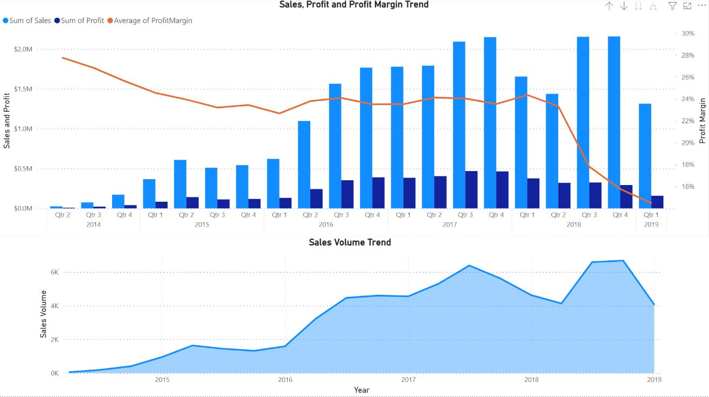
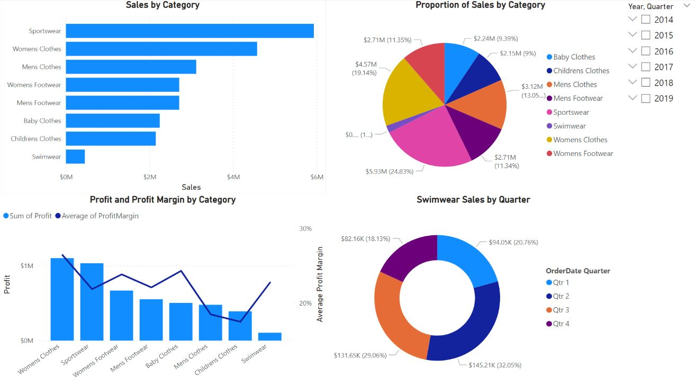
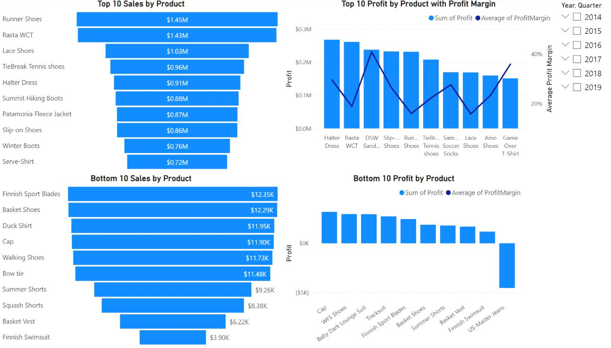
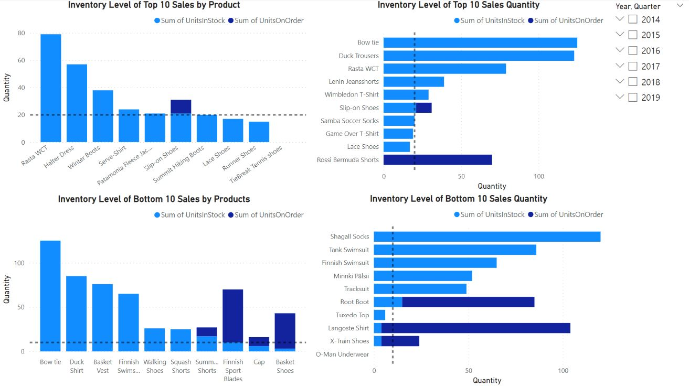
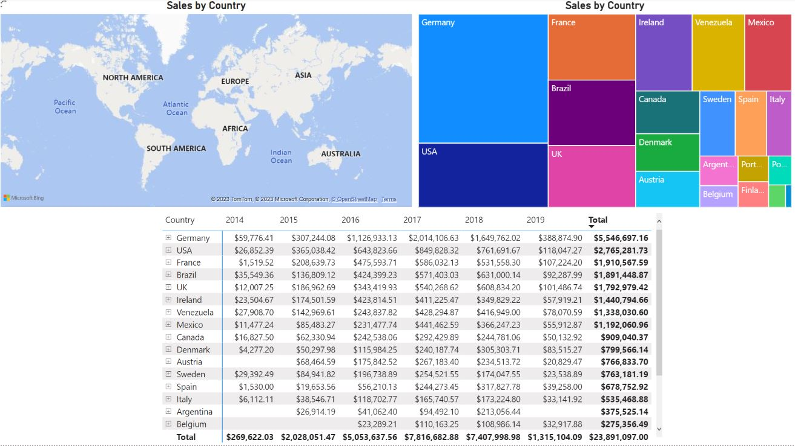
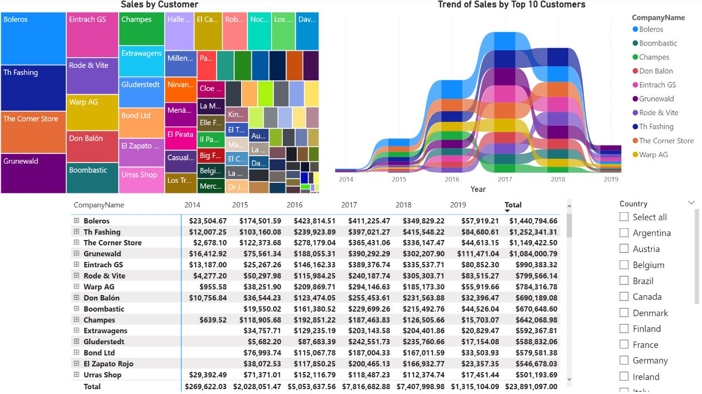
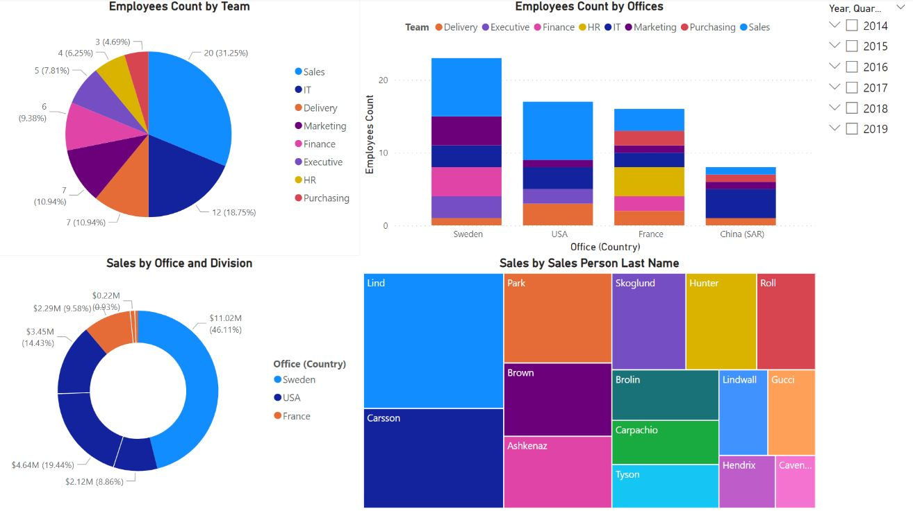

## Table of Contents
1. [Objectives](README.md#objectives)
2. [Steps](README.md#steps)
3. [Data Exploration & Dimensional Model Building](README.md#data--building)
4. [Data Visualizations Building](README.md#data--building)
5. [Business Insights & Recommendations](README.md#business--recommendations)

## Objectives
* **Role**: A business analyst in an apparel company.
* **Goals**: 
    a. To identify a business issue, given a dataset. 
    b. To document and to perform data exploration and data extract, transform, and load (ETL) to build a dimensional model 
    c. To create interactive data visualizations (charts, reports and dashboards) 
    d. To document and to present the business insights and recommendations

## Steps
1. The dataset consisted of 13 files of various formats (MS Excel, CSV and XML).

2. Loaded files into MS PowerBI and performed exploratory data analysis. Dimensional model was built. The dataset was then wrangled, cleaned and added with additional features. 

3. Finally, dashboards were created using MS PowerBI. Insights and recommendations were derived from the visualizations. 

## Data Exploration & Dimensional Model Building
### MS PowerBI
1. The dataset (13 files with 15 tables) were loaded into PowerBI and explored. 

2. Dimensional model was built as shown. 
    
    a. Shipments table was merged into orderdetails with OrderID, LineNo and ProductID as key. This merged table was renamed as orderdetails_fact, as it was identified as the fact table as it contained the measures 
       for analysis to be performed upon, such as “unitprice” and “quantity”.

    b. 5 dimensions tables are identified / built. They were orders_dim, customers_dim, Employees_dim, products_dim and shippers_dim.

    c. orders table was renamed as orders_dim and linked to orderdetails_fact with OrderID as key. 
    
    d. divisions table was merged into customers table with DivisionID as key. The merged table was renamed as customers_dim and linked to orderdetails_fact with CustomerID as key. 

    e. team table was merged into employee_team with TeamID as key. employees_new table (New Employees) was appended to employees table. office table was merged into employees table with OfficeID as key and renamed 
       as Employees_dim and linked to orderdetails_fact with EmployeeID as key.

    f. categories table was merged into products table with CategoryID as key. supplier_band table was merged into suppliers table with SupplierBandID as key and renamed as suppliers_combined. suppliers_combined was 
       then merged into products table with SupplierID as key. The merged table was then renamed as products_dim and linked to orderdetails_fact with ProductID as key.

    g. shippers was renamed as shippers_dim and linked to orderdetails_fact with ShipperID as key.

3. Additional Columns (DAX Language)
    a. Sales
    b. Cost
    c. Profit
    d. ProfitMargin
    
4. Identified Business Issue

From the sales, profit and profit margin trend, we could observe that there was a general trend of increasing sales and profit from Q2 2014 to Q4 2017.  This was followed by a sharp decrease from Q4 2017 to Q2 2018. In Q3 2018, there was a sharp increase, followed by a sharp decrease from Q4 2018 to Q1 2019. 
For average profit margin, it decreased from 27.76% in Q2 2014 to 23.21% in Q3 2015. After which, it remained relatively constant until Q2 2018 ranging from 22.67% to 24.36%. Since then, there was a drastic drop to 14.48% in Q1 2019. 
For a business to operate smoothly, we do not like to experience such sharp sales and profit fluctuations. As such, we would like to prevent sharp decrease of sales and profit from happening and look at ways to increase sales and profit.

## Data Visualizations Building
### MS PowerBI
1. Loaded the csv file into PowerBI. It took around 10 minutes for the data to be loaded as the files files was more than 1.1GB.  

2. I checked for data type consistency and existence null values. There were null values present in the dataset. Fortunately, the columns that I was interested in did not contain any null values.  

3. The 2 measures that I was interested were sales and profit. Hence, I designed the dashboard and created 8 visualizations based on number of sales analysis and profit analysis. 

   a.	By Category

   b.	By Product

   c.	By Inventory

   d.	By Country
   
   e.   By Customer
   
   f.   By Employee

## Business Insights & Recommendations
### Business Insights

#### Dashboard - Category Analysis

1. We could see that highest sales do not necessarily mean higher profit. Although “Sportwear” raked in the highest sales, “Womens Clothes” had a higher profit and profit margin. The same applied to “Mens Clothes” and “Womens Footwear”, where “Mens Clothes” had higher sales but “Womens Footwear” had higher profit and profit margin. 
Furthermore, we observe that while “Swimwear” had the least sales and profit, it had the highest profit margin. We also observe that sales of “Swimwear” are the highest in Q2 and Q3. This is probably due to the fact that Q2 and Q3 are the hotter seasons where demand for “Swimwear” is higher. 

#### Dashboard - Product Analysis

2a. Top 10 Products: Similar to category analysis’ scenario, the product with highest sales, “Runner Shoes” only came in at position 5 for its total profit due to its relatively lower margins. “Halter Dress” on the other hand, with the 5 position in sales, raked in the highest profit. 
Some of the top 10 profit products did not even make it to the top 10 sales, such as “DSW Sandals” and “ Samba Soccer Socks”, “Aino Shoes” and “Game Over T-shirt”. This was again due to their high profit margins ranging from 23.41% (“Aino Shoes”) to 40.86% (“DSW Sandals”).  
2b. Bottom 10 Products: “US-Master Jeans” were sold at a loss. Perhaps the management wanted to clear this product as soon as possible, hence sold them at a loss. 
There were products that appear in both bottom 10 sales and bottom 10 profit, such as “Finnish Swimsuit”, “Basket Vest”, “Summer Shorts”, “Cap”, “Basket Shoes” and “Finnish Sport Blades”.

#### Dashboard - Inventory Analysis

3. For the inventory level of the top 10 sales product, we could see that the purchasing of goods were not carried out diligently. “Slip-on Shoes” with a stock level of 21 had an impending order while “Lace Shoes” and “Runner Shoes” with stock level of 17 and 15 respectively did not have any impending order. 
Similarly, for inventory level of the top 10 sales quantity product, “Slip-on Shoes” had an impending order while “Game Over T-Shirt” and “Lace Shoes” with stock level of 19 and 17 respectively did not have impending order. 
Note that stocks for “Rossi Bermuda Shorts” had depleted and currently has an impending order. As this is one of the top 10 selling products, inventory for this product should not be depleted at any time.

#### Dashboard - Country Analysis

4. There were 8 countries with sales of more than $1M. Ranking by sales in descending order are Germany, USA, France, Brazil, UK, Ireland, Venezuela and Mexico. Sales from Germany are about twice that of USA.

#### Dashboard - Customer Analysis

5. “Boleros” had always been the top customer until 2018. Since then, their sales from them have been deteriorating. On the other hand, sales and sales ranking for Th Fashing have been increasing over the years and they even became the biggest customer in 2018. 

#### Dashboard - Employee Analysis

6. Sales team made up the largest proportion of the employees in the company at 31.25%, followed by IT at 18.75%. Sweden has the most number of employees, followed by USA and France. 
There were 7 employees in China (SAR). However, there were no sales from China in the records. Most likely, the company was setting up an office in China (SAR). This was evident as the number of IT employees was quite high at 4, which suggested that the company was probably setting up some IT infrastructure there. 
Although majority of the sales came from Sweden and USA office, France office had almost the same number of employees as USA. This was because France office employed quite a number of supporting teams, like HR, Finance and Purchasing. 
In terms of sales person, the highest sales came from Lind (Sweden office) at $4.26M, followed by Carsson (USA office) at $3.15M. On the other hand, the lowest sales came from Cavendish (Sweden office) at $475K, followed by Hendrix (Sweden office) at $671K.

### Recommendations
1. From insight 1: 
   a. Look into marketing and promotional efforts for products with higher profit margins, such as “Womens Clothes”, “ Womens Footwear” and “Baby Clothes”. 
   b. Promote “Swimwear” during Q2 and Q3 and bring them off the shelves during colder seasons in Q1 and Q4, and free up the space for perhaps, winter sportswear.

2. From insight 2: 
   a. For top 10 products in terms of sales and profit, increase marketing and promotional efforts to boost those products with higher profit margin. 
   b. For products that appeared in both bottom 10 sales and bottom 10 profit, consider dropping these products, free up the space, and replace them with other products.

3. From insight 3: 
   a. To standardize the inventory restock level at 20 units for products in top 10 sales and top 10 sales quantity. A reference line for re-stock level had been added. 
   b. Reduce inventory restock level at 10 units for products in bottom 10 sales and bottom 10 sales quantity. A reference line for re-stock level had been added too.

4. From insight 4: 
   a. To put in resources to maintain business relations with these countries.
   
5. From insight 5: 
   a. Find out the underlying reasons for those customers that have dropped in sales and look for possible ways to improve them.
   
6. From insight 6: 
   a. Setting up a new office in China (SAR) is an excellent growth driver. The company can tap on this new office to obtain lower cost supplies and generate new sales. Sales of better quality EMEA/USA-made products can       be sold to China while cheaper China-made products can be sold to EMEA and USA. 
   b. In order to further boost sales, top sales persons shall be incentivized while the bottom sales persons shall be encouraged to perform better.
